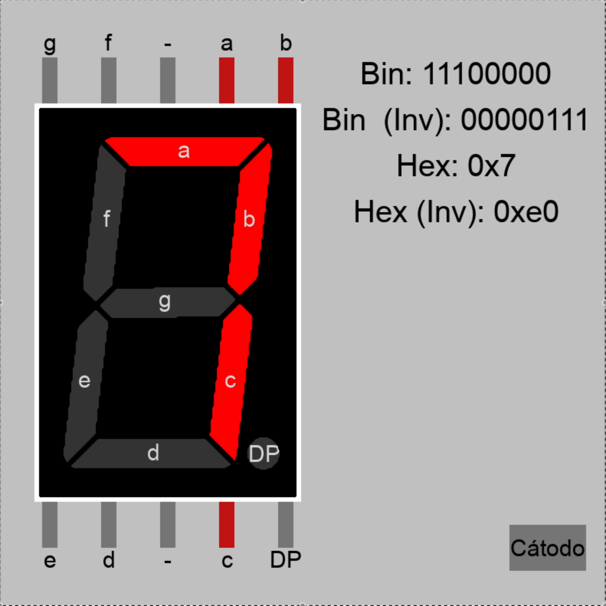

# Display7
 
Simulador grafico de un display de 7 segmentos.



## Requerimientos

- Python 3.9+
- [Pygame](https://www.pygame.org/)

## Como ejecutar

```bash
git clone https://github.com/Ranguel/Display7
cd Display7
python main.py
